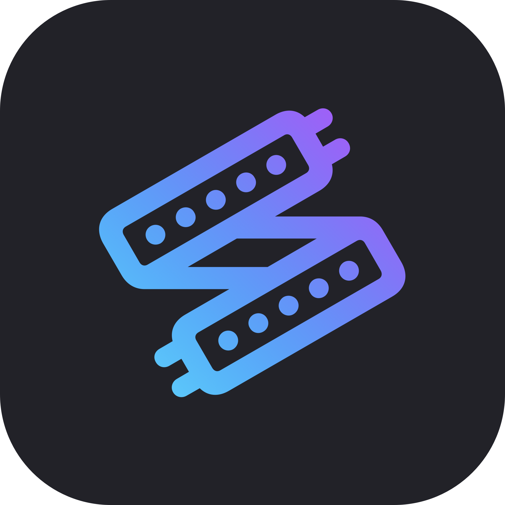

<p align="center">
  
</p>

<h1 align="center">HaloSync</h1>

<p align="center">
  <strong>High-performance, zero-latency ambient lighting pipeline for macOS.</strong><br>
  Built with ScreenCaptureKit, Metal, and native SwiftUI.
</p>

<p align="center">
  <a href="https://github.com/rawcode-dev/halosync/actions/workflows/ci.yml">
    
  </a>
  <a href="https://github.com/rawcode-dev/halosync/releases/latest">
    
  </a>
</p>

---

## ⚡️ Quick Install (For Normal Users)

Transform your Mac into an immersive ambient lighting experience! HaloSync connects directly to WLED / Pixylights controllers over your local network to synchronize your LED strips with your display in real-time.

1. **[⬇️ Download the latest HaloSync.dmg](https://github.com/rawcode-dev/halosync/releases/latest)** from the Releases page.
2. Open the `.dmg` file and drag **HaloSync** into your **Applications** folder.
3. Open HaloSync from Launchpad.
4. The app will automatically discover your WLED controller on the network. Customize your LED layout in the **Layout** tab, and toggle **Screen Sync** on!

> **Note:** HaloSync is unsigned software. The first time you open it, you may need to **Right Click > Open** and accept the security prompt, or go to System Settings > Privacy & Security to allow it.

---

## 🛠 Features

- **Blazing Fast Pipeline:** Uses Apple's native `ScreenCaptureKit` and hardware-accelerated `Metal` shaders to process frames with less than 20ms of end-to-end latency.
- **Smart Letterbox Detection:** Automatically crops out black cinematic borders on movies so your LEDs don't turn off during widescreen playback.
- **FluidEngine Smoothing:** Implements custom temporal interpolation to prevent jarring LED strobing, resulting in buttery smooth color transitions.
- **Auto Discovery:** Zero-configuration setup via mDNS (Bonjour). Instantly finds WLED controllers on your LAN.
- **Built-in Calibration Engine:** Test for dead pixels, identify your color order (RGB/GRB), and walk individual LEDs straight from the app.

---

## 🧑‍💻 Development & Architecture

HaloSync is built as a highly modular, decoupled modern macOS application. We heavily rely on Dependency Injection (DI) and SwiftUI's `ObservableObject` state management.

### Tech Stack
- **Language:** Swift 5.10 / macOS 14.0+
- **UI:** SwiftUI + Glassmorphism Design System
- **Video Capture:** ScreenCaptureKit
- **Image Processing:** Metal (`.metal` shaders)
- **Network:** Network.framework (Asynchronous UDP fire-and-forget packets)

### Core Pipeline Architecture

The real-time loop runs at a target 60FPS:

1. **`SCKCaptureEngine`**: Grabs raw CVPixelBuffers directly from the Mac's display buffer.
2. **`MetalProcessor`**: Dispatches a compute shader (`ZoneSampler.metal`) that downsamples the 4K screen into a tiny array of edge colors mapping exactly to the physical LED count. 
3. **`FluidEngine`**: Applies temporal smoothing (EMA filters) and brightness corrections.
4. **`WLEDUDPController`**: Encodes the final array into WLED DDP / Raw UDP packets and blasts them over the network.

### Building Locally

HaloSync uses [XcodeGen](https://github.com/yonaskolb/XcodeGen) to prevent messy `.xcodeproj` git conflicts. 

1. Install XcodeGen:
   ```bash
   brew install xcodegen
   ```
2. Clone the repository and generate the project:
   ```bash
   git clone https://github.com/rawcode-dev/halosync.git
   cd halosync
   xcodegen generate
   ```
3. Open `HaloSync.xcodeproj` and hit **Run (Cmd+R)**!

---

## 🤝 Contributors

HaloSync is an open-source project. Pull requests, bug reports, and feature requests are welcome!

- **Bibhuti Bhusan Pani** (`@bapu`) - Lead Developer / Creator
- *Looking for contributors! Check out our open issues.*

### How to Contribute
1. Fork the Project
2. Create your Feature Branch (`git checkout -b feature/AmazingFeature`)
3. Commit your Changes (`git commit -m 'Add some AmazingFeature'`)
4. Push to the Branch (`git push origin feature/AmazingFeature`)
5. Open a Pull Request

---

## 📄 License

Distributed under the MIT License. See `LICENSE` for more information.
